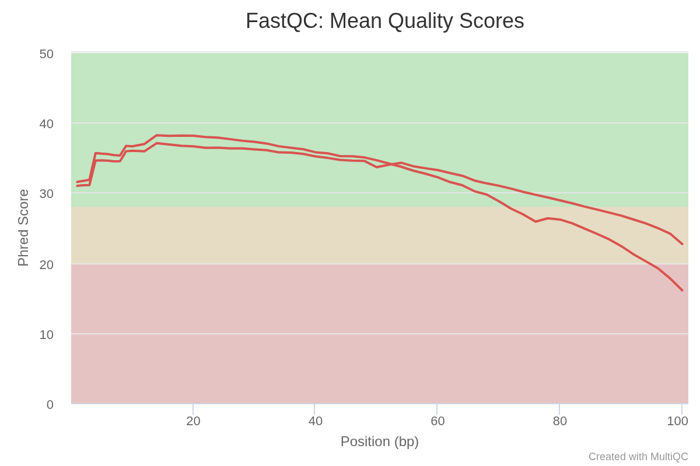
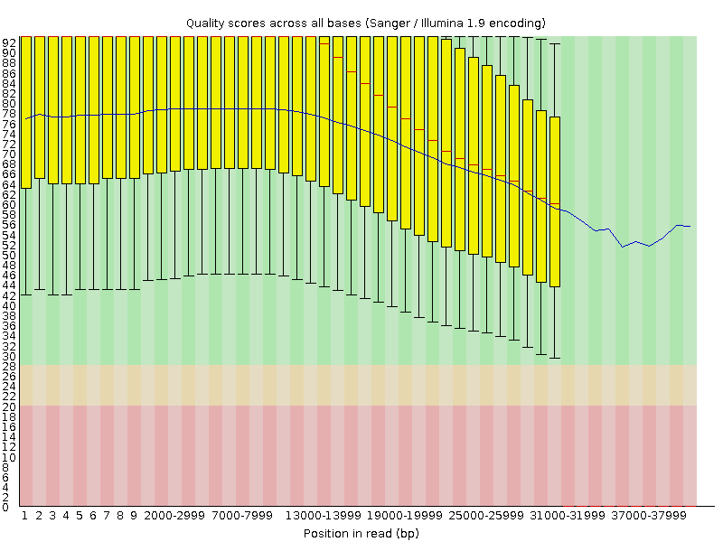
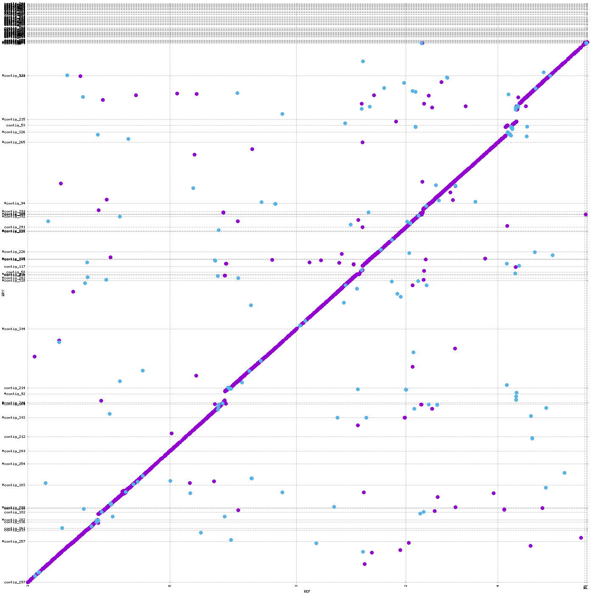
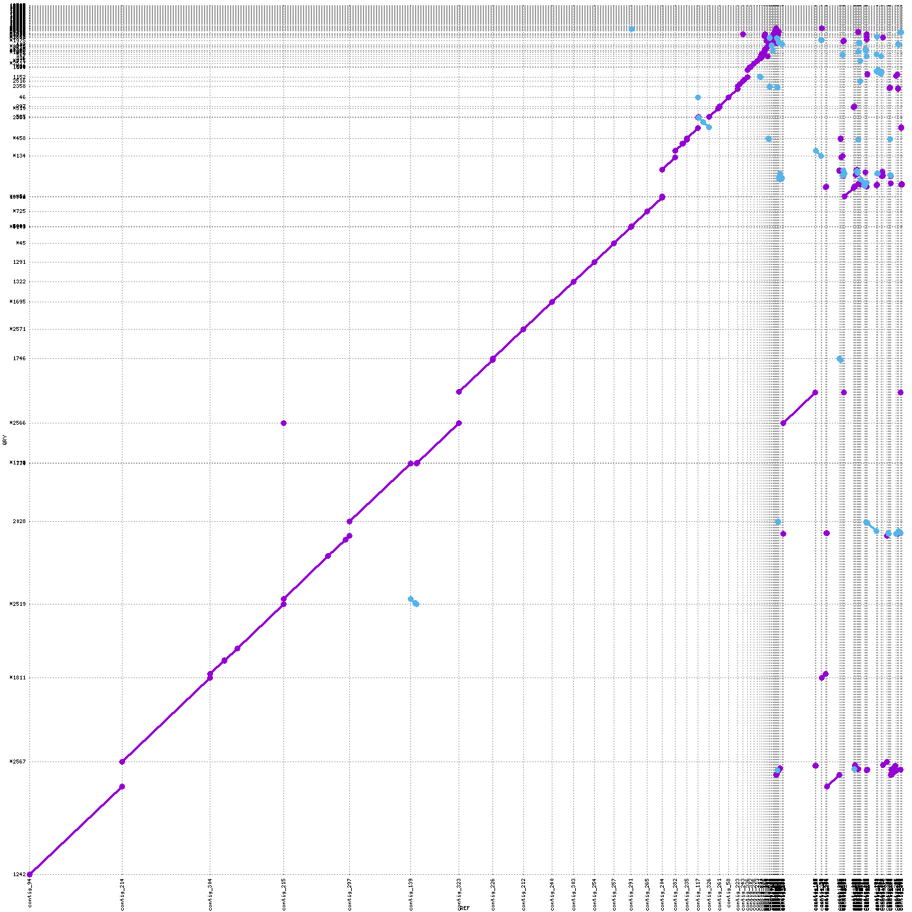
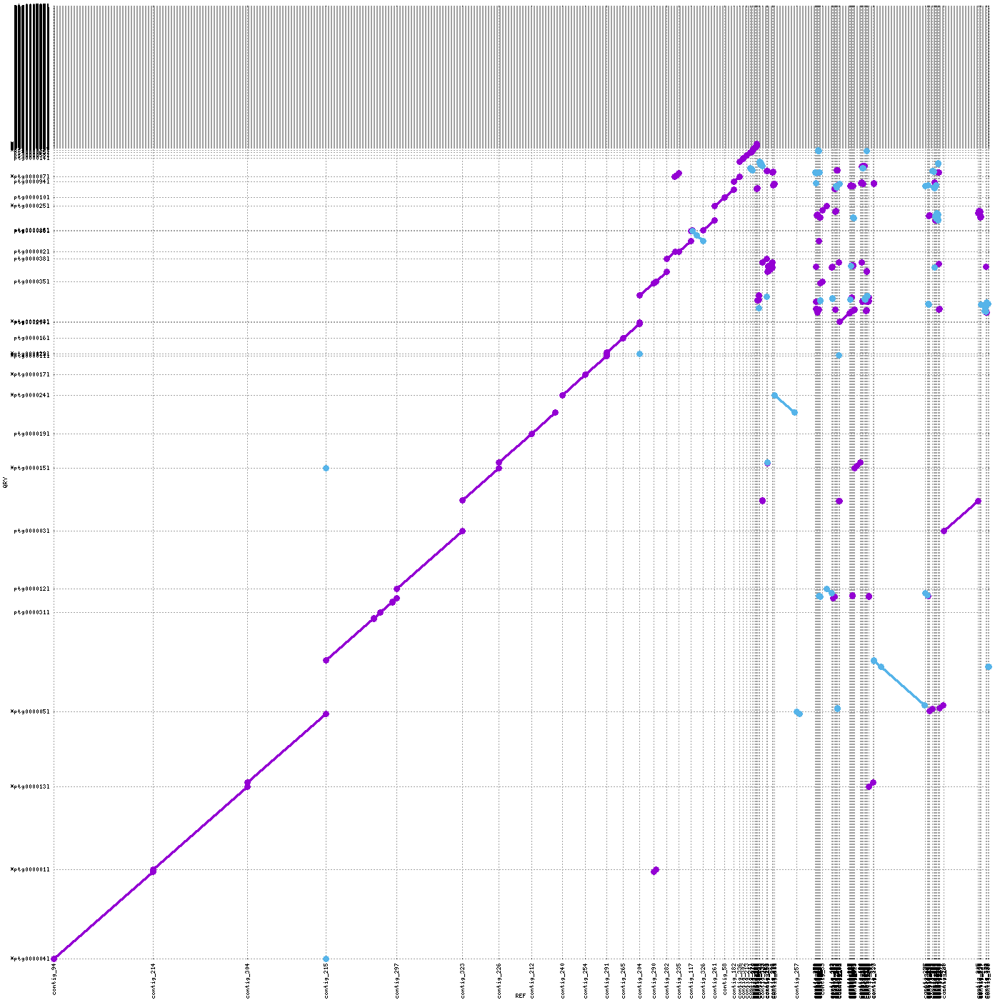
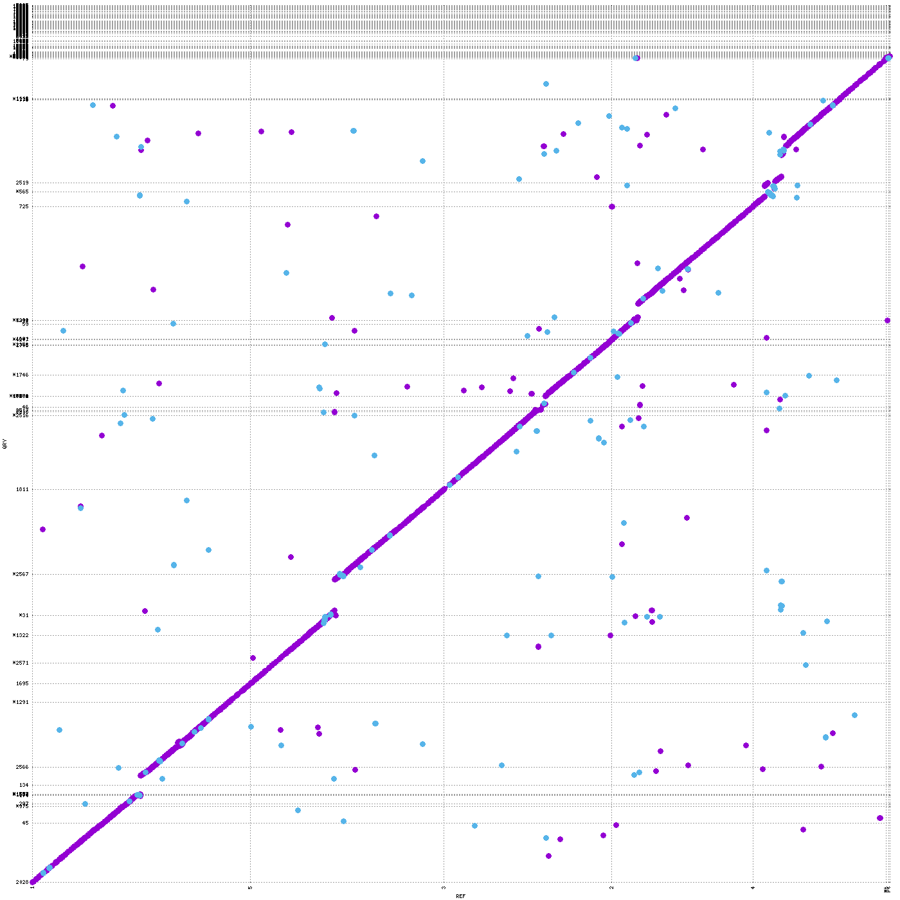
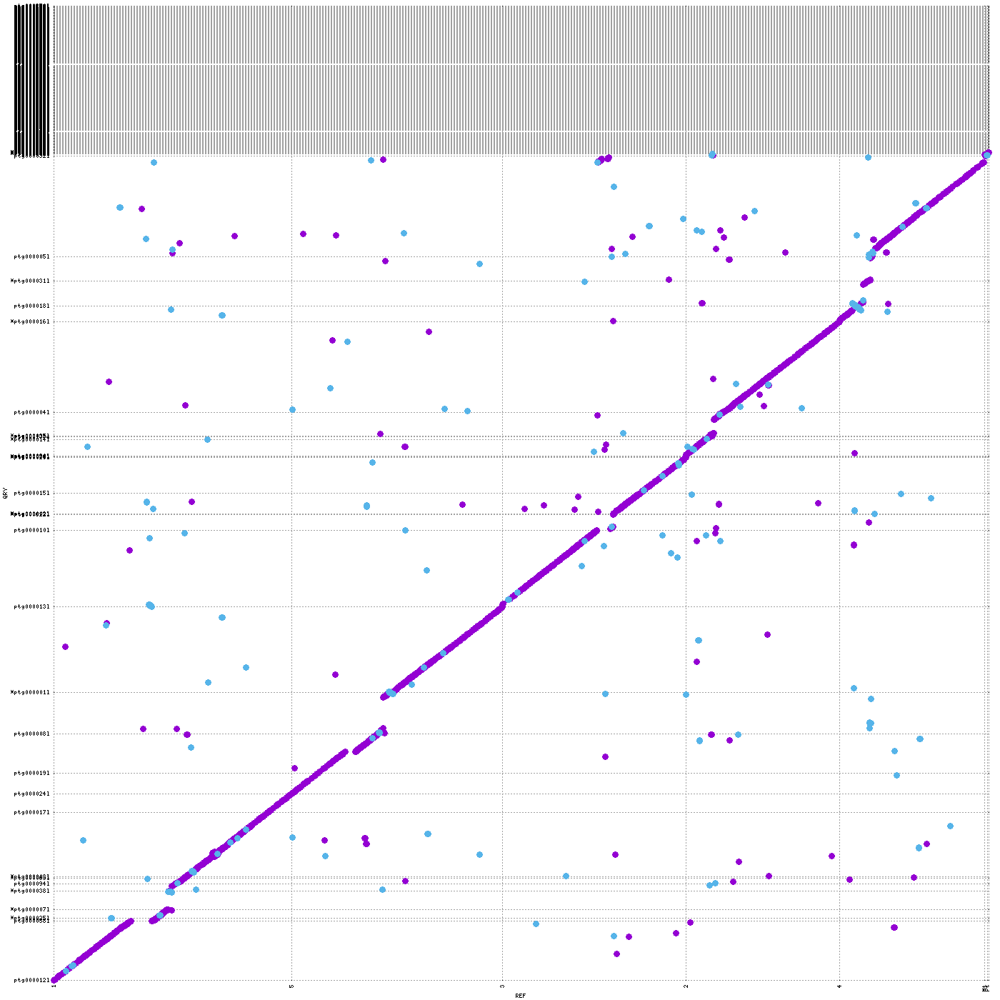
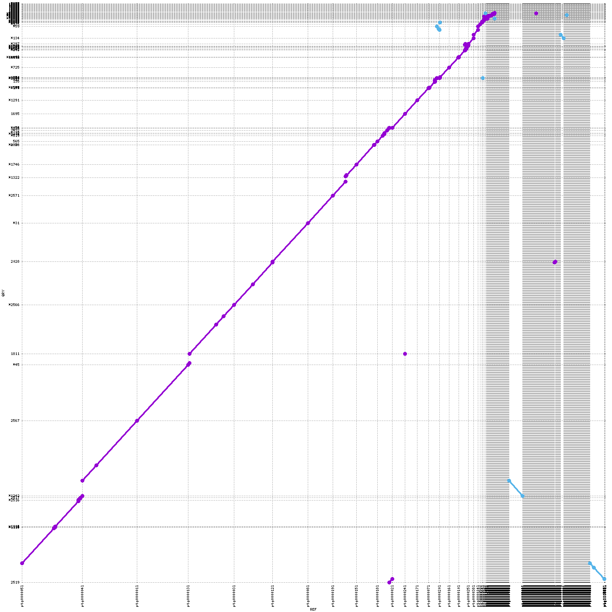

# Genome & Transcriptome Assembly Course

For the genome and transcriptome assembly, we worked with two types of data: Illumina paired-end RNA-seq reads and PacBio HiFi reads. With these data, we had to carry out the following tasks:

- **Genome assembly (PacBio HiFi, sample Nov-02, accession ERR11437321):** comparison of long-read assemblers, including quality control, k-mer profiling, assembly with several tools, evaluation of the assemblies, and genome comparison of the assemblies against the reference and against each other.
- **Transcriptome assembly (Illumina paired-end short reads, accession ERR754081):** quality control, trimming and cleaning, assembly with Trinity, and evaluation of the assemblies.

The PacBio HiFi data come from the *Arabidopsis thaliana* pan-genome study of Lian et al. (2024) [[1]](#references), which sequenced 69 accessions. Nov-02 is one of the accessions analysed here.

## Repository structure

```
assembly_annotation_course/
├── busco_downloads/
│   └── lineages
│       └── brassicales_odb10
├── data/
│   ├── Nov-02
│   └── RNAseq_Sha
├── images/
├── results/
│   ├── Assemblies/
│   │   ├── Flye/
│   │   ├── HiFiASM/
│   │   ├── LJA/
│   │   └── trinity_out_dir/
│   ├── Assemblies_QC/
│   │   ├── BUSCO/
│   │   ├── merqury/
│   │   └── QUAST/
│   ├── Genome_comparison/
│   └── reads_QC/
│       ├── fastp/
│       ├── fastqc/
│       └── jellyfish/
└── script/
```

## Workflow

| Step | Purpose | Tool(s) |
|------|---------|---------|
| 1. Read quality control | Assess read length, GC content, duplication and base quality | FastQC |
| 2. Trimming and cleaning | Remove adapters and low-quality reads | fastp |
| 3. K-mer analysis | Estimate genome size, coverage and heterozygosity | k-mer profiling (k = 21) |
| 4. Assembly | Assemble the genome (HiFi reads) and the transcriptome (short reads) | Flye, hifiasm, LJA (genome); Trinity (transcriptome) |
| 5. Assessment | Evaluate completeness, contiguity and accuracy | BUSCO, QUAST, Merqury |
| 6. Genome comparison | Compare the assemblies against the reference and against each other | nucmer, mummerplot |

## Results

### 1. Read quality (FastQC)
- **PacBio HiFi (ERR11437321)**

| Sample Name | Accession | % Dups | % GC | Length | % Failed | M Seqs | Total Bases | Q20 bases | Q30 bases |
|---|---|---|---|---|---|---|---|---|---|
| Nov-02 | ERR11437321 | 6.1% | 36% | 15271 bp | 20% | 0.3 | 4.1 Gbp | 4.1 Gbp (98.48%) | 4.02 Gbp (96.39%) |


| RNA-seq (Illumina) | PacBio HiFi |
|:---:|:---:|
|  |  |

### 2. Trimming and cleaning (fastp)

- **Illumina (ERR754081)**

| Parameter | Value |
|---|---|
| Accession | ERR754081 |
| fastp version | 0.23.2 |
| Sequencing | Paired-end (101 + 101 cycles) |
| Duplication rate | 6.61% |
| Insert size peak | 125 bp |
| Detected adapter, read 1 | AGATCGGAAGAGCACACGTCTGAACTCCAGTCA |
| Detected adapter, read 2 | AGATCGGAAGAGCGTCGTGTAGGGAAAGAGTGT |

| Metric | Before filtering | After filtering |
|---|---|---|
| Total reads | 45.24 M | 43.38 M |
| Total bases | 4.57 Gbp | 4.06 Gbp |
| Mean read length (R1, R2) | 101 bp, 101 bp | 92 bp, 94 bp |
| Q20 bases | 4.06 Gbp (88.92%) | 3.91 Gbp (96.39%) |
| Q30 bases | 3.59 Gbp (78.55%) | 3.46 Gbp (85.30%) |
| GC content | 46.33% | 45.94% |

| Filtering result | Reads | % of input |
|---|---|---|
| Passed filters | 43.38 M | 95.88% |
| Low quality | 21.6 K | 0.05% |
| Too many N | 290 | 0.00% |
| Too short | 1.84 M | 4.07% |

### 3. K-mer profile

- **PacBio HiFi (ERR11437321)**

| Accession | K-mer size | Depth of coverage | Genome size | Heterozygosity | % Unique sequence |
|---|---|---|---|---|---|
| Nov-02 | 21 | 21.8x | 161.8 Mb | 0.001% | 64.3% |

### 4. Completeness (BUSCO)

C = complete, S = single-copy, D = duplicated, F = fragmented, M = missing.

| Accession | Assembly | C (%) | S (%) | D (%) | F (%) | M (%) |
|---|---|---|---|---|---|---|
| Nov-02 | Flye | 99.9 | 98.9 | 1.0 | 0.1 | 0.0 |
| Nov-02 | hifiasm | 97.1 | 96.1 | 1.0 | 0.1 | 2.8 |
| Nov-02 | LJA | 99.9 | 98.8 | 1.1 | 0.1 | 0.0 |
| Nov-02 | Trinity | 78.7 | 39.4 | 39.3 | 3.6 | 17.7 |

> Trinity is a transcriptome assembler, so its poor genome-level BUSCO scores (high duplication, many missing genes) are expected. 

### 5. Contiguity and correctness (QUAST)

| Accession | Assembly | # contigs | Total length | N50 | NG50 | L90 | N90 | Duplication ratio | Genome fraction (%) |
|---|---|---|---|---|---|---|---|---|---|
| Nov-02 | Flye | 194 | 137,592,964 | 5,335,244 | 4,861,350 | 29 | 747,106 | 1.051 | 89.874 |
| Nov-02 | hifiasm | 641 | 159,282,273 | 6,781,566 | 10,518,828 | 163 | 45,187 | 1.286 | 86.736 |
| Nov-02 | LJA | 390 | 144,095,067 | 9,672,502 | 10,707,360 | 21 | 1,456,833 | 1.092 | 89.963 |

### 6. Base accuracy and k-mer completeness (Merqury)

| Accession | Assembly | Error k-mers (assembly only) | Total k-mers | QV | Error rate (per kb) | 1 / error rate (per base) | k-mer completeness (%) |
|---|---|---|---|---|---|---|---|
| Nov-02 | Flye | 2,278 | 137,589,084 | 61.03 | 7.88E-04 | 1,268,371 | 98.89 |
| Nov-02 | hifiasm | 12,511 | 159,269,453 | 54.27 | 3.74E-03 | 267,328 | 95.57 |
| Nov-02 | LJA | 11,829 | 144,087,267 | 54.08 | 3.91E-03 | 255,788 | 98.96 |

### 7. Genome Comparison 

| Flye vs Reference | Flye vs LJA | Flye vs HiFiASM |
|:---:|:---:|:---:|
|  |  |  |

| LJA vs Reference | HiFiASM vs Reference | HiFiASM vs LJA |
|:---:|:---:|:---:|
|  |  |  |

## Final choice

**Best assembler for Nov-02: Flye**

| Criterion | Flye | hifiasm | LJA | Best |
|---|---|---|---|---|
| BUSCO complete (C) | 99.9% | 97.1% | 99.9% | Flye = LJA |
| BUSCO single-copy (S) | 98.9% | 96.1% | 98.8% | Flye |
| Merqury QV | 61.03 | 54.27 | 54.08 | Flye |
| 1 / error rate (per base)| 1.27 Mb | 267 kb | 256 kb | Flye |
| Duplication ratio | 1.051 | 1.286 | 1.092 | Flye |
| # contigs | 194 | 641 | 390 | Flye |
| Genome fraction | 89.87% | 86.74% | 89.96% | LJA (+0.09%) |
| N50 / NG50 / L90 / N90 | 5.3 Mb / 4.9 Mb / 29 / 747 kb | 6.8 Mb / 10.5 Mb / 163 / 45 kb | 9.7 Mb / 10.7 Mb / 21 / 1.46 Mb | LJA |
| k-mer completeness | 98.89% | 95.57% | 98.96% | LJA (+0.07%) |

## References

1. Lian, Q. et al. (2024). A pan-genome of 69 *Arabidopsis thaliana* accessions reveals a conserved genome structure throughout the global species range. *Nature Genetics*, 56, 982–991.